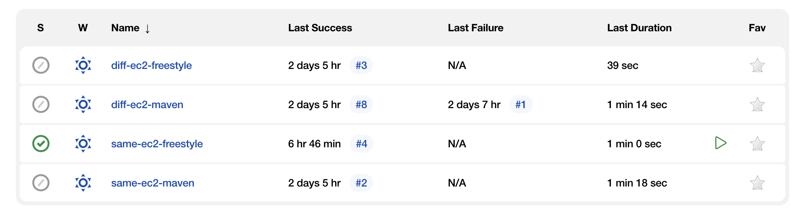

# eCommerce Application

Real-world project from [Java Web Developer Nanodegree](https://www.udacity.com/course/java-developer-nanodegree--nd035) at Udacity.

The application allows users to perform basic operations for online shopping, including creating new accounts, adding items to the cart, submitting orders and viewing their order history.

The project requires to add authorization with implementing proper security and hashing, analyze the metrics, and automate the configuration and deployment of these systems and the application.

## Summary

- [Demo](#demo)
- [Technologies](#technologies)
- [Deployments](#deployments)
- [Analytics](#analytics)

## Demo

### CI/CD


### Splunk


## Technologies

- Add authorization using ```Spring Security``` with ```username/password``` and ```JSON Web Tokens (JWT)``` combinations.
- Write tests with ```JUnit``` and ```Mockito```, and meet at least 80% code coverage level.
- Identify the correct metrics for logging with ```SLF4J``` and ```Log4J```, in order to monitor the system.
- Index and analyze the metrics with ```Splunk```.
- Use ```Jenkins``` to integrate with the version control and build a ```CI/CD``` pipeline to deploy the application to the ```Tomcat``` server in a ```Docker``` container residing on the ```AWS EC2 instance```.

## Deployments



There are 4 types of deployments implemented:

- **diff-ec2-freestyle**: ```Jenkins Freestyle Project``` that deploys the application to the ```Tomcat``` in a new container residing on a different ```EC2 instance``` from the one where ```Jenkins``` is running.

- **diff-ec2-maven**: Similar to ```diff-ec2-freestyle```, but it's built with the ```Maven Integration Plugin```.

- **same-ec2-freestyle**: ```Jenkins Freestyle Project``` that deploys the application to the ```Tomcat``` in a new container residing on the same ```EC2 instance``` as the one where ```Jenkins``` is running.

- **same-ec2-maven**: Similar to ```same-ec2-freestyle```, but it's built with the ```Maven Integration Plugin```.

## Analytics

The project identifys the correct metrics to log, to monitor the system and index metrics to ```Splunk```.

### Metrics

The code traces the following metrics to log:

- `CreateUser` request successes
- `CreateUser` request failures
- `UsernameNotFoundException` when login
- Order requests successes
- Order requests failures

### Dashboards

There are two dashboards created for success rate per day, per hour and per minute of any one create user and submit order.

[Watch demo for details](#splunk).

### Alerts

There is one alert set up to monitor logins with invalid username. Everytime the alert is triggerd, an email will be sent to the given email address.

[Watch demo for details](#splunk).